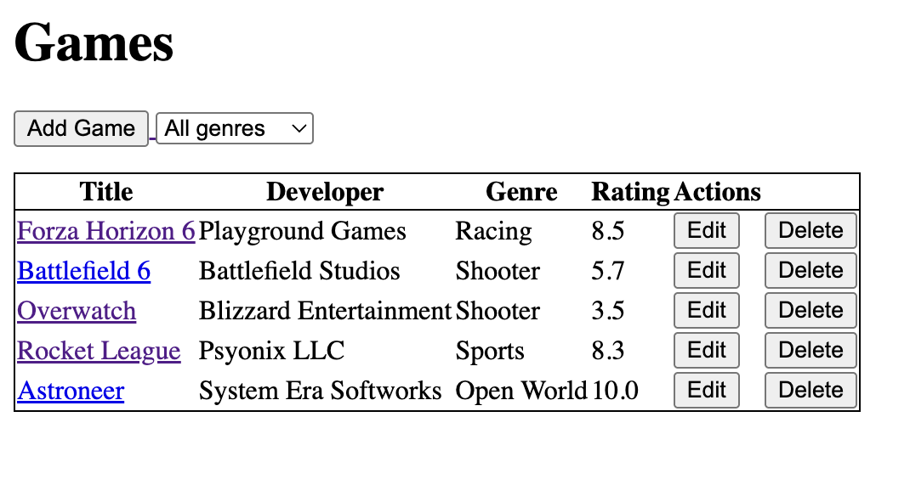

# Per Scholas SBA318 - Express Server Application

(06/? - 06/21)
Lab Assignment.

## Preview:

## Description:

The objective is to create a simple Express Server that utilizes 3 sets of related data and meets the following requirements:

- Create and use at least two pieces of custom middleware.
- Create and use error-handling middleware.
- Use at least three different data categories (e.g., users, posts, or comments).
- Utilize reasonable data structuring practices.
- Create GET routes for all data that should be exposed to the client.
- Create POST routes for data, as appropriate. At least one data category should allow for client creation via a POST request.
- Create PATCH or PUT routes for data, as appropriate. At least one data category should allow for client manipulation via a PATCH or PUT request.
- Create DELETE routes for data, as appropriate. At least one data category should allow for client deletion via a DELETE request.
- Include query parameters for data filtering, where appropriate. At least one data category should allow for additional filtering through the use of query parameters.
- Utilize route parameters, where appropriate.
- Use simple CSS to style the rendered views.
- Include a form within a rendered view that allows for interaction with your RESTful API.
- Commit frequently.

## Author

**[Richard](https://github.com/RichardRiv)**
